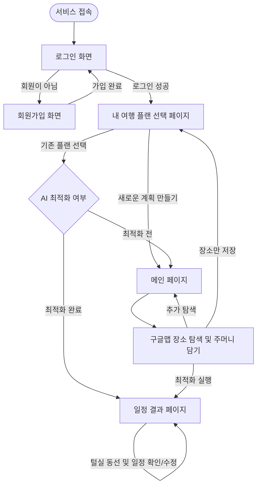

# ✈️ 의외로 쉬운 여행, 의쉬행 (3차 팀 프로젝트)

> **"의외로 쉬운 여행, 의외로 쉬운 행복!"**  
> **"가고 싶은 장소만 담으세요, 동선 짜는 고민은 AI가 해결해 드립니다."**  
> 
> `의쉬행`은 복잡한 여행 계획 과정을 극도로 단순화하여, 누구나 손쉽게 최적의 일정을 수립하고 여행의 즐거움에만 집중할 수 있도록 돕는 스마트 여행 플래너 웹 서비스입니다.

---

## 💡 프로젝트 소개

### 1. 사용 방법
1. **유저:** 여행할 지역을 정하고, 가고 싶은 관광지/맛집/숙소를 자유롭게 담습니다.
2. **AI:** 숙소 위치와 여행 기간(N박 N일)을 기반으로 일차별 최적의 일정을 자동으로 생성합니다.

### 2. 핵심 기능
- **스마트 동선 최적화:** 저장된 장소들의 **휴무일**, **브레이크 타임**, **장소 간 이동 거리**를 종합적으로 계산하여 동선을 자동 배치합니다.
- **일차별 일정 추천:** N박 N일 일정에 맞춘 효율적인 일자별 동선을 제시합니다.

### 3. 차별점 & 강점
- 🎨 **Minimal UI:** 복잡한 요소를 배제하고 여행 플래너 본연의 목적에 집중한 심플한 디자인
- 👆 **User-Friendly:** 여행 계획이 낯선 초보자도 몇 번의 클릭만으로 손쉽게 완성하는 직관적인 UX

---

## 🎨 기획 및 디자인 (Design & Architecture)

### 1. 피그마 디자인 시안 (Figma)
- 🔗 [Figma 디자인 시안 바로가기](https://www.figma.com/design/Tr34nleQ0fN0o2VThwd68F/%EC%9D%98%EC%99%B8%EB%A1%9C-%EC%89%AC%EC%9A%B4-%EC%97%AC%ED%96%89?m=auto&t=q17Uf3ew0zVRPNaM-6)

### 2. 주요 화면 설계 (UI Layout)
| 메인 페이지 (장소 탐색) | 일정 결과 페이지 (동선 확인) |
| :---: | :---: |
|  |  |
| 구글맵 연동 및 장소 수집 | AI 기반 N박 N일 최적 동선 시각화 |

---

## 📋 기능 명세서 및 로드맵 (Features & Roadmap)

### 1. 🎯 핵심 기능 (MVP / 필수 구현)
- [ ] **회원가입 및 로그인:** 유저 인증 및 사용자별 개인 데이터 관리
- [ ] **여행 플랜 관리:** 신규 여행 계획 생성 및 기존 작성/저장된 플랜 조회
- [ ] **구글 맵 연동 & 주머니 담기:** 지도 기반 장소 탐색 및 원하는 관광지/맛집/숙소를 여행 주머니에 수집
- [ ] **AI 동선 최적화:** 주머니에 담은 장소의 정보(영업시간, 휴무일, 브레이크타임) 및 장소 간 이동 거리를 계산하여 효율적인 일차별 일정 자동 생성

---

### 2. ⚙️ 세부 일정 및 AI 제어 설정 (Detail Options)
API 호출 효율화 및 정확도 높은 AI 동선 작성을 위해 **필수 사전 정보가 입력된 후 최적화를 실행**합니다.

* **기본 제어 설정:**
  * 하루 활동 시간대 지정 (예: 09:00 ~ 22:00)
  * 식사 옵션 지정 (아침 식사 포함 여부 등)
  * 이동 관련 사전 정보 (공항 도착 시간, 숙소 위치 등)
* **장소별 고정 제어 설정:**
  * 특정 장소의 지정 일차/시간대 고정 (예: 야경 장소는 밤 시간대 배정)
  * 날씨 및 환경 조건 고려 (우천 시 실내 일정 우선 배치 등)

---

### 3. 🔮 향후 확장 기능 및 로드맵 (Roadmap)
> 개발 진행 상황 및 우선순위에 따라 순차적으로 업데이트될 추가 기능입니다.

- [ ] **자동 로그인 기능:** 사용자 편의성을 위한 세션/토큰 기반 자동 로그인
- [ ] **스마트 추천 기능:** 
  - 특정 지역의 인기 관광지 및 맛집 추천 기능
  - **무계획 여행자 전용 코스 추천:** 여행 시기(우기/건기, 계절), 권장 여행 기간을 고려한 국가 및 코스 추천
- [ ] **원거리 동선 예외 처리:** 4박 5일 등 장거리 이동이 포함된 동선의 분선 처리 가이드 제공

---

## 🗺️ 유저 플로우 (User Flow)

`의쉬행` 서비스의 전체 사용자 이용 흐름입니다. 로그인부터 새로운 여행 계획 작성, 기존 플랜 관리까지의 주요 동선입니다.

---

## 🛠️ 기술 스택 (Tech Stack)

- **Frontend:** TypeScript, React, Vite
- **Design & Tools:** Figma
- **Code Quality:** ESLint, Prettier

---

## 🌿 Git 브랜치 전략 (GitHub Flow)

1인 개발 특성에 맞춰 **규칙을 최소화하고 개발 속도를 극대화**하는 단순화 전략을 사용합니다.

- **`main`**: 항상 **버그가 없고 시연/발표가 가능한 상태**를 유지하는 배포용 브랜치
- **`feature/기능명`**: 기능 개발 및 UI 작업 시 생성 후, 완료되면 `main`에 병합(Merge) 및 삭제
  - 예시: `feature/login`, `feature/planner`, `fix/navbar-bug`

---

## 📝 커밋 메시지 컨벤션 (Conventional Commits)

| Prefix | Description | Example |
| :---: | :--- | :--- |
| **`feat`** | 새로운 기능 추가 | `feat: AI 동선 추천 API 연동` |
| **`fix`** | 버그 수정 | `fix: 일정 삭제 시 UI 미갱신 오류 수정` |
| **`docs`** | 문서 수정 | `docs: README.md 내용 업데이트` |
| **`refactor`**| 코드 리팩토링 (기능 변경 없음) | `refactor: 일정 계산 로직 구조 개선` |

---

## 👥 Member

- **Hwang Gilyong** ([@kickboardboy-coder](https://github.com/kickboardboy-coder)) - 기획 / 프론트엔드 개발
